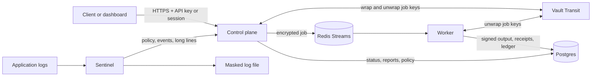

# Cold Harbour

[](https://github.com/deakR/cold-harbour/actions/workflows/ci.yml)
[](LICENSE)

Cold Harbour removes personal data from text and log lines, and keeps signed proof of what it did.

You send text to an HTTP API. A worker finds emails, phone numbers, SSNs, Aadhaar numbers, and PAN numbers, replaces them with placeholders, and signs the result. It then destroys its encrypted working copy and writes a signed receipt for that deletion. Receipts, policy changes, key changes, and logins are appended to a per-tenant, hash-chained audit ledger, which the included `verify` tool can check.

A companion process, Sentinel, applies the same detectors to application logs before they reach disk.

> **Status:** work in progress. It is not a hosted service and has not had a security audit.

## Features

- **Redaction jobs.** `redact` replaces detected values with tokens such as `[EMAIL_REDACTED]`. `mask` replaces named fields in a JSON document with `[MASKED]`.
- **Six detectors.** `email`, `phone_us`, `ssn`, `phone_in`, `aadhaar` (Verhoeff checksum), and `pan`. Each tenant chooses its detectors through a policy.
- **Encryption at rest.** Queued input is encrypted with a per-job AES-256-GCM key. The key is wrapped by HashiCorp Vault Transit and destroyed after the job completes.
- **Signed outputs and purge receipts.** Results and deletion receipts are signed with Ed25519.
- **Tamper-evident audit ledger.** Purge receipts, policy changes, key creation and revocation, and session logins and logouts are appended to a per-tenant hash chain.
- **Compliance export.** A CSV per tenant lists each job, its checksum, signature status, and purge time.
- **Multi-tenant.** Tenants cannot see each other's jobs. A job from another tenant returns `404`.
- **Log masking.** Sentinel tails a log file, masks each line, and reports counters to the control plane.
- **Dashboard.** A React UI for jobs, results, delivery links, reports, and Sentinel nodes, with session-cookie login and CSRF protection.

## How it works



1. The control plane accepts a job, encrypts the input with a fresh key, and puts it on a Redis stream.
2. A worker takes the job, runs the tenant's detectors, and signs the output.
3. The worker deletes the queued input, destroys the job key, and writes a signed purge receipt.
4. The job's status, output, and receipt are stored in Postgres, and each event is appended to the tenant's ledger.

The control plane never redacts text itself. Redaction happens only in the worker and in Sentinel.

## Quickstart

This path runs the whole stack in Docker. It is the same sequence CI runs on every pull request.

**You need:** Docker with Compose, Go 1.25.1 or later, and Bash for the certificate script (Git Bash or WSL on Windows). The examples use PowerShell.

1. Generate the local CA and TLS certificates for Postgres and Redis.

   ```powershell
   bash scripts/gen-certs.sh
   ```

2. Set the service passwords and generate an Ed25519 signing key.

   ```powershell
   $env:POSTGRES_PASSWORD = "change-me"
   $env:REDIS_PASSWORD = "change-me"

   $dir = New-Item -ItemType Directory -Force "$env:TEMP\ch-signkey"
   @'
   package main

   import (
   	"crypto/ed25519"
   	"crypto/rand"
   	"encoding/base64"
   	"fmt"
   )

   func main() {
   	_, priv, err := ed25519.GenerateKey(rand.Reader)
   	if err != nil {
   		panic(err)
   	}
   	fmt.Print(base64.StdEncoding.EncodeToString(priv))
   }
   '@ | Set-Content "$dir\main.go"
   Push-Location $dir; go mod init signkey 2>$null; $env:SIGNING_KEY = go run .; Pop-Location
   ```

   Keep `SIGNING_KEY` somewhere safe. Signatures made with it can only be checked against its public half.

3. Start Postgres, Redis, Vault, the control plane, and the worker.

   ```powershell
   docker compose up -d --build
   ```

   The API listens on `http://127.0.0.1:8081`. The control plane applies the database schema when it starts.

4. Create a tenant. The command prints the tenant's first admin API key.

   ```powershell
   $env:POSTGRES_DSN = "postgres://coldharbour:$env:POSTGRES_PASSWORD@127.0.0.1:5433/coldharbour?sslmode=verify-full&sslrootcert=docker/certs/ca.crt"
   $env:API_KEY = (go run ./cmd/coldharbour admin create-tenant --name demo).Trim()
   ```

5. Submit a redaction job and read the result.

   ```powershell
   $h = @{ "X-API-Key" = $env:API_KEY }
   $body = @{ input = "Contact jane.doe@example.com or (555) 123-4567. SSN 123-45-6789." } | ConvertTo-Json
   $job = Invoke-RestMethod -Method Post -Uri http://127.0.0.1:8081/v1/jobs -Headers $h -ContentType "application/json" -Body $body
   Start-Sleep -Seconds 2
   Invoke-RestMethod -Uri "http://127.0.0.1:8081/v1/jobs/$($job.jobId)" -Headers $h | ConvertTo-Json -Depth 5
   ```

   A completed job returns `status`, the redacted `result`, an Ed25519 `signature`, and the `signingKeyId`. If the status is still `QUEUED`, run the last command again.

6. Check the tenant's audit ledger. The command exits non-zero on the first broken link.

   ```powershell
   $tenant = docker exec coldharbour-m7-postgres psql -U coldharbour -d coldharbour -tA -c "SELECT id FROM tenants WHERE name = 'demo'"
   go run ./cmd/verify ledger --tenant $tenant.Trim()
   ```

To stop the stack, run `docker compose down`. Postgres data is kept in the `postgres-data` volume. Add `-v` to delete it.

## Dashboard

The dashboard logs in with a session cookie. Over plain HTTP on localhost, the control plane must allow a non-`Secure` cookie. Create a `docker-compose.override.yml` next to `docker-compose.yml` (Compose loads it automatically):

```yaml
services:
  controlplane:
    environment:
      ALLOW_INSECURE_SESSION_COOKIE: "1"
```

Then restart the control plane and start the dashboard. You need Node.js 22.

```powershell
docker compose up -d controlplane
cd dashboard
npm install
npm run dev
```

Open `http://localhost:5173` and log in with an `admin` or `app` key. Vite proxies `/v1` and `/d` to `http://127.0.0.1:8081`. The key is exchanged for an HTTP-only session cookie and a CSRF token. It is not stored in the browser or sent in the WebSocket URL.

Use `ALLOW_INSECURE_SESSION_COOKIE` only for local development. The override file is gitignored.

## Sentinel

Sentinel is a log masker. It reads lines from a file or stdin, masks them with the tenant's policy, and writes the result. It fetches the policy from the control plane, keeps a local copy in case the control plane is down, can hand very long lines to the API, and reports counters that appear in the dashboard.

### Try the demo profile

Stop any control plane or worker you started from source, then run:

```powershell
docker compose --profile sentinel up --build
```

This adds three services. An example logger writes lines with fake personal data. A bootstrap job creates the `sentinel-demo` tenant and writes a Sentinel key. Sentinel masks the logger's output.

```powershell
# Masked log output
docker run --rm -v coldharbour_sentinel-logs:/logs busybox:1.37 cat /logs/app.masked.log

# The Sentinel service key. It is not a dashboard login key.
docker run --rm -v coldharbour_sentinel-keys:/keys busybox:1.37 cat /keys/sentinel.key
```

### Run it yourself

```powershell
$env:SENTINEL_API_KEY = "<sentinel key>"
go run ./cmd/sentinel run --in app.log --follow --out app.masked.log --control-plane http://127.0.0.1:8081 --node-id my-host
```

| Flag | Default | Meaning |
| --- | --- | --- |
| `--in` / `--out` | `-` | Input and output paths. `-` means stdin or stdout. |
| `--follow` | `false` | Keep reading as the input file grows. |
| `--control-plane` | none | Cold Harbour base URL for policy, events, and long-line handoff. |
| `--policy` | none | Policy file to use when the control plane cannot be reached. |
| `--state-dir` | none | Directory for the cached policy. |
| `--policy-interval` | `60s` | How often to fetch the policy. |
| `--events-interval` | `10s` | How often to send counters to the control plane. |
| `--node-id` | none | Node name shown in the dashboard. |
| `--max-inline-bytes` | `65536` | Longest line masked locally. Longer lines are sent to the control plane. If that fails, the tenant's `failPolicy` decides what happens. |
| `--shadow` | `false` | Count detections but write lines unchanged. |
| `--allow-fail-open` | `false` | Required before a fail policy of `open` may write unmasked lines. |
| `--metrics` | `:9101` | Prometheus listen address. |

## API reference

Authenticate with an `X-API-Key` header or a session cookie. Requests that change state with a session cookie must also send the CSRF token. `POST /v1/session/login` and `GET /d/{token}` are public.

### Sessions

| Method and path | Description |
| --- | --- |
| `POST /v1/session/login` | Body `{"apiKey": "..."}`, for an `admin` or `app` key. Sets the session cookie and returns a CSRF token. |
| `GET /v1/session` | Returns the CSRF token for the current session. |
| `POST /v1/session/logout` | Revokes the session and clears the cookie. |

### Jobs

| Method and path | Description |
| --- | --- |
| `POST /v1/jobs` | Queues a job. Body `{"input": string, "jobType": "redact" \| "mask", "source": "cold-harbour" \| "sentinel"}`. `jobType` defaults to `redact`. Returns `{"jobId", "status": "QUEUED"}`. Limited to 30 requests per minute per tenant. |
| `GET /v1/jobs` | Lists the tenant's jobs, newest first. |
| `GET /v1/jobs/{id}` | Returns the job status. A completed job also has `result`, `signature`, and `signingKeyId`. |
| `POST /v1/jobs/{id}/delivery-links` | Creates a shareable link to the result that expires and allows a limited number of views. Body `{"expiresAt": RFC 3339, "maxViews": "1" to "100"}`. The expiry can be up to 30 days away. The token is returned only once. |
| `GET /d/{token}` | Returns the result for a valid delivery token. No API key is needed. |

For a `mask` job, `input` is a JSON string such as `{"document": {"name": "Jane", "plan": "pro"}, "fields": ["name"]}`.

### Policy, reports, and keys

| Method and path | Description |
| --- | --- |
| `GET /v1/policy` | Returns the tenant policy with an `ETag`. Supports `If-None-Match`. The default detectors are `email`, `phone_us`, and `ssn`. |
| `PUT /v1/policy` | Admin only. Sets `detectors`, `mode` (`redact` or `partial`), `failPolicy` (`closed`, `inline`, or `open`), and `maxInlineBytes`. |
| `GET /v1/reports/compliance?from=&to=` | Returns a CSV with columns `dispatch_time, completion_time, final_state, checksum, signature_status, purge_timestamp, source`. |
| `GET /v1/keys` | Admin only. Lists API keys. |
| `POST /v1/keys` | Admin only. Body `{"name": string, "role": "admin" \| "app" \| "sentinel"}`. |
| `DELETE /v1/keys/{id}` | Admin only. Revokes a key immediately. |

### Sentinel and events

| Method and path | Description |
| --- | --- |
| `GET /v1/sentinel/nodes` | Lists the tenant's Sentinel nodes and their counters. |
| `POST /v1/sentinel/events` | Sentinel keys only. Accepts a batch of node counters. |
| `GET /v1/ws/events` | WebSocket stream of the tenant's job and node events. |

### Roles

| Role | Can do |
| --- | --- |
| `admin` | Everything, including policy and key management. |
| `app` | Submit and read jobs, create delivery links, download reports, read the policy, and use the dashboard. |
| `sentinel` | Read the policy, post Sentinel events, list nodes, and hand off long lines through `POST /v1/jobs`. It cannot log in to the dashboard. |

`coldharbour admin create-tenant` prints the first `admin` key. Create `app` and `sentinel` keys with `POST /v1/keys`.

## Command-line tools

| Command | Purpose |
| --- | --- |
| `go run ./cmd/controlplane` | HTTP API, migrations, sessions, and the WebSocket relay. |
| `go run ./cmd/worker -consumer <name>` | Job worker. Run several with different consumer names to scale out. |
| `go run ./cmd/sentinel run ...` | Log masker. See [Sentinel](#sentinel). |
| `go run ./cmd/coldharbour migrate` | Applies the database migrations. |
| `go run ./cmd/coldharbour admin create-tenant --name <name>` | Creates a tenant and prints its admin key. |
| `go run ./cmd/coldharbour admin ensure-sentinel-key ...` | Creates or reuses a Sentinel key file. Used by the demo profile. |
| `go run ./cmd/verify ledger --tenant <id>` | Checks a tenant's audit chain. |
| `go run ./cmd/verify output ...` / `receipt ...` | Checks a signed output or purge receipt offline. Run it with `-h` to see the flags. |
| `go run ./cmd/sentinel-load` | Detector benchmark and CI performance gate. |

## Configuration

| Variable | Used by | Description |
| --- | --- | --- |
| `POSTGRES_DSN` | control plane, worker, `coldharbour`, `verify ledger` | Postgres connection string. |
| `REDIS_ADDR` | control plane, worker | Redis address. Default `127.0.0.1:6379`. Compose publishes Redis on `6380`. |
| `REDIS_PASSWORD` | control plane, worker | Redis password. |
| `REDIS_TLS`, `REDIS_CA` | control plane, worker | Set `REDIS_TLS=1` and point `REDIS_CA` at the CA certificate to use TLS. |
| `VAULT_ADDR`, `VAULT_TOKEN` | control plane, worker | Vault address and token. Required. |
| `SIGNING_KEY` | worker | Base64 of a 64-byte Ed25519 private key. |
| `PORT` | control plane | HTTP port. Default `8080`. Compose publishes it on `8081`. |
| `WS_ORIGIN_PATTERNS` | control plane | Comma-separated browser origins allowed for login and WebSocket. Default `localhost:5173,127.0.0.1:5173`. |
| `ALLOW_INSECURE_SESSION_COOKIE` | control plane | `1` drops the `Secure` flag on the session cookie. Local HTTP only. |
| `CONSUMER` | worker | Redis consumer name. The `-consumer` flag wins. The default is the hostname. |
| `SENTINEL_API_KEY`, `SENTINEL_API_KEY_FILE` | Sentinel | Sentinel key, or a path to a file that contains it. |
| `WRITE_PROFILE` | `sentinel-load` | `1` writes `bench/cpu.pprof` and `bench/alloc.pprof`. |

The Compose file publishes Postgres on port `5433` and Redis on port `6380`, so the stack does not clash with local installs.

## Quality gates

CI runs these on every pull request. A pull request cannot merge until they all pass.

- **Unit and integration tests** against real Postgres and Redis.
- **Contract tests** against the full Compose stack, including tenant isolation and WebSocket filtering, followed by a ledger check for every tenant.
- **Detector accuracy.** A labeled set of realistic log lines, with 100 positives per detector and 300 near-misses. The build fails if precision or recall drops below the set floor. The current score is 1.00 for both on every detector.
- **Performance.** `cmd/sentinel-load` masks 100,000 lines. The build fails if p99 latency is over 5 ms or throughput falls below 80% of `bench/baseline.json`, which is currently 12.2 MB/s with a p99 of 0.19 ms on a CI runner.
- **Security scans.** `gosec` for Go code and Trivy for critical vulnerabilities.
- **Dashboard build** with TypeScript and Vite.

## Project layout

| Path | Contents |
| --- | --- |
| `cmd/` | Entry points: `controlplane`, `worker`, `sentinel`, `coldharbour`, `verify`, and `sentinel-load`. |
| `internal/api` | HTTP handlers, authentication, sessions, policy, keys, reports, and events. |
| `internal/detect` | Detectors and the accuracy test data. |
| `internal/redact`, `internal/mask` | Job runners. |
| `internal/queue` | Redis streams, consumer groups, retries, dead letters, and purging. |
| `internal/seal` | AES-GCM encryption, Ed25519 signing, Vault key wrapping, and receipts. |
| `internal/journal`, `internal/ledger` | Job records and the per-tenant hash chain. |
| `migrations/` | Postgres schema, applied with Goose. |
| `dashboard/` | React and TypeScript UI. |
| `docker/`, `docker-compose.yml`, `Dockerfile.*` | Local stack and container images. |
| `dev/seed.sql` | Optional fixed tenant rows for development (`docker compose --profile dev up seed`). It creates no API keys. |
| `examples/sentinel-logger` | Demo log writer used by the Sentinel profile. |
| `scripts/gen-certs.sh` | Local CA and server certificate generator. |
| `bench/baseline.json` | Performance baseline used by CI. |

## Contributing

See [CONTRIBUTING.md](CONTRIBUTING.md) for how to run the stack from source, the full test commands, and pull request conventions.

## Security

Please do not open public issues for vulnerabilities. See [SECURITY.md](SECURITY.md) for private reporting.

## License

[Apache License 2.0](LICENSE)
